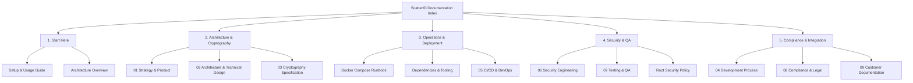

# ScatterID Documentation Library

Welcome to the comprehensive documentation library for **ScatterID** — a post-quantum, zero-knowledge identity verification infrastructure leveraging NIST FIPS 204 (ML-DSA-65), RFC 8785 JSON canonicalization, and Hyperledger Fabric.

---

## 🗺️ Master Documentation Index

---

### 1. 🚀 Start Here
Essential guides for getting started, running the stack locally, and understanding the core value proposition:
* **[Setup and Usage Guide](SETUP_AND_USAGE.md)** — Step-by-step local provisioning, container orchestration, environment configuration, and verification.
* **[High-Level Architecture Overview](architecture-overview.md)** — Executive architectural diagram, microservice topologies, and sequence flows.
* **[01. Strategy & Product Specification](01-strategy-and-product.md)** — Problem statement, market landscape, user personas, and product roadmap.

---

### 2. 🧮 Architecture & Cryptography
Deep-dive mathematical models, PQC signature schemes, and ledger anchoring:
* **[02. Architecture & Technical Design](02-architecture-and-technical-design.md)** — Microservice specifications (Crypto Service, Verification API, Vault KMS, Hyperledger Fabric).
* **[03. Cryptography Specification](03-cryptography-specific.md)** — NIST FIPS 204 ML-DSA-65 implementation, RFC 8785 canonicalization, CSPRNG salting, and SHA3-256 commitments.
* **[Offline Mathematical Verification Tools](../tools/verify_offline.js)** — Zero-dependency standalone CLI tools for independent offline verification in [Node.js](../tools/verify_offline.js) and [Python](../tools/verify_offline.py).

---

### 3. ⚙️ Operations & Deployment
Containerization runbooks, environment configuration, and pipeline mechanics:
* **[Docker Compose Runbook](docker-compose.md)** — Multi-container topologies, profiles (backend-only vs. full dashboard), and volume bindings.
* **[Dependencies & Prerequisites](DEPENDENCIES.md)** — Detailed software requirements, system tools, Docker prerequisites, and PQC library builds.
* **[05. CI/CD & DevOps Pipeline](05-cicd-and-devops.md)** — Automated test execution, security scans (Gitleaks, CodeQL, pip-audit, npm audit), and container builds.

---

### 4. 🛡️ Security & Quality Assurance
Threat modeling, cryptographic boundaries, test suites, and audit logging:
* **[06. Security Engineering](06-security-engineering.md)** — Threat vectors, timing-safe authentication, mTLS encryption, Vault KMS hardening, and audit logging.
* **[07. Testing & Quality Assurance](07-testing-and-qa.md)** — Unit test coverage, integration tests, offline verification parity test suite, and live ledger tests.
* **[Root Security Policy](../SECURITY.md)** — Vulnerability reporting guidelines, API key tier definitions (`VERIFICATION_API_KEY`, `REVOKE_API_KEY`), and supported versions.

---

### 5. 📜 Compliance, Governance & Client Integration
Legal compliance, development guidelines, and customer onboarding:
* **[04. Development Process](04-development-process.md)** — Coding standards, git workflow, contribution guide, and release cycles.
* **[08. Compliance & Legal Framework](08-compliance-and-legal.md)** — GDPR compliance analysis, data minimization (zero raw claim storage on-chain), and jurisdictional privacy law.
* **[09. Customer Integration Guide](09-documentation-for-customers.md)** — Integration runbook for relying parties, verifiers, and enterprise credential issuers using `@scatterid/sdk`.

---

### 6. 🏛️ Operations Console, Client Portal & Governance Policy Suite
Detailed operational runbooks, portal specifications, agile policy governance, and disaster recovery:
* **[Engineering Issue Board & Verification Matrix](PROJECT_BOARD.md)** — Issue tracking (`ISSUE-101` to `ISSUE-104`), Kanban status, and 107-test automated verification suite.
* **[Ops & Access Documentation Suite Overview](ops-and-portal/05-README-documentation-overview.md)** — Master overview of ops console, client portal, and multi-tier routing architecture.
* **[01. Internal Dashboard Requirements & Access](ops-and-portal/01-internal-dashboard-requirements-and-access.md)** — Operations Console requirements, RBAC hierarchy (Clerk $\subset$ Mod $\subset$ Root), and audit logging.
* **[02. Internal Dashboard UI/UX Design](ops-and-portal/02-internal-dashboard-ui-ux-design.md)** — Executive command console layout, pending queues, key lifecycle gauges, and policy configuration.
* **[03. Client Portal Requirements & Access](ops-and-portal/03-client-portal-requirements-and-access.md)** — Counter clerk help desk requirements, station attribution, and 4-point physical checklist rules.
* **[04. Client Portal UI/UX Design](ops-and-portal/04-client-portal-ui-ux-design.md)** — Client portal layout, drag-and-drop digital scan SHA-256 calculator, verification desk, and tracking stepper.
* **[06. Disaster Recovery & Key Lifecycle](ops-and-portal/06-disaster-recovery-and-key-lifecycle.md)** — Advance PQC key pre-distribution, emergency cutover, dual-key grace periods, encrypted `.enc` backups, and break-glass CLI.
* **[07. Network Topology & Micro-Segmentation](ops-and-portal/07-network-topology-and-segmentation.md)** — 3-zone network segmentation, WireGuard mesh, and iptables firewall isolation rules.
* **[08. Engineering Methodology & Verification Architecture](ops-and-portal/08-engineering-methodology-and-verification-architecture.md)** — Two-level verification (RFC 8785 + ML-DSA-87), defensive coding invariants, and atomic testing.
* **[Verification Channel & Escalation Addendum](ops-and-portal/verification-channel-and-escalation-addendum.md)** — Normative Hard vs. Soft evidentiary standards and fraud escalation rules.

---

## 🔗 Quick Reference Links
* **Repository Root:** [README.md](../README.md)
* **Project Board:** [docs/PROJECT_BOARD.md](PROJECT_BOARD.md)
* **SDK Documentation:** [sdk/README.md](../sdk/package.json)
* **Visual SDK Playground:** [examples/web-app](../examples/web-app)
* **Project Changelog:** [CHANGELOG.md](../CHANGELOG.md)
* **License (PolyForm Noncommercial 1.0.0):** [LICENSE](../LICENSE)

