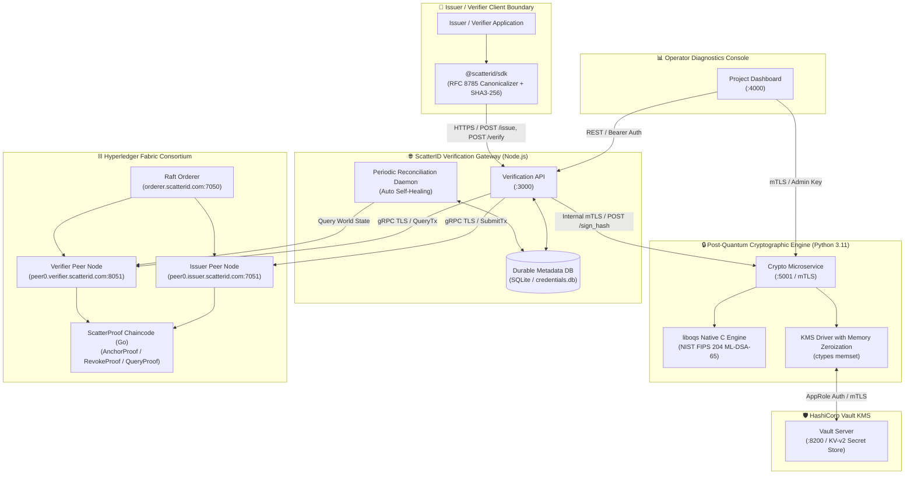
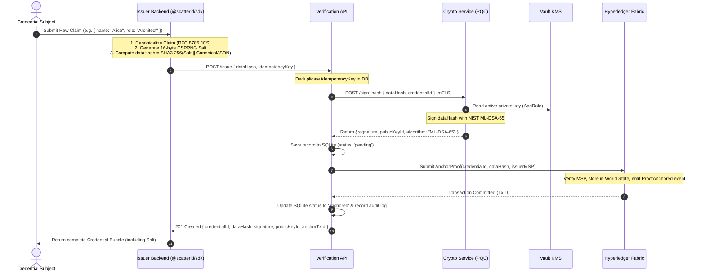
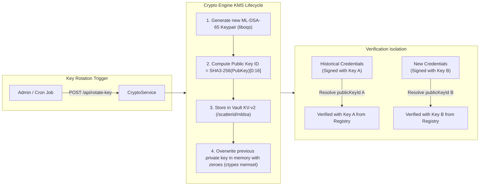

# ScatterID Architecture Overview

ScatterID is a decentralized, zero-knowledge, post-quantum identity verification infrastructure. It combines NIST FIPS 204 ML-DSA-65 digital signatures, client-side RFC 8785 JSON canonicalization with CSPRNG salting, and immutable permissioned ledger anchoring via Hyperledger Fabric.

---

## 1. System Topology & Component Architecture

The following diagram illustrates the complete microservice architecture, communication protocols, network boundaries, and credential storage layers:

---

## 2. Zero-Knowledge Issuance Protocol

Raw identity claims never leave the organization's backend. Only a cryptographic pre-image commitment (`dataHash`) is ever transmitted to ScatterID.

---

## 3. Dual-Mode Verification Architecture

ScatterID supports two independent modes of verification: **Online Trust-Boundary Verification** (real-time blockchain validation) and **Zero-Dependency Offline Verification** (air-gapped mathematical checking).

```mermaid
graph TD
    subgraph InputBundle["Credential Bundle Presentation"]
        Claim["Original JSON Claim"]
        Salt["16-byte Secret Salt"]
        Proof["Proof Bundle (dataHash, signature, publicKeyId, credentialId)"]
    end

    subgraph ModeSelection["Verification Mode Selection"]
        Online["1. Online Verification (Real-Time)"]
        Offline["2. Offline Verification (Air-Gapped)"]
    end

    Claim --> ModeSelection
    Salt --> ModeSelection
    Proof --> ModeSelection

    subgraph OnlineFlow["Online Verification Workflow"]
        On1["SDK: Compute dataHash = SHA3-256(Salt || Claim)"]
        On2["POST /verify { credentialId, dataHash }"]
        On3["Gateway queries Vault Key Registry for publicKeyId"]
        On4["Crypto Microservice verifies ML-DSA-65 signature"]
        On5["Gateway queries Fabric Ledger for active status"]
        On6["Fail-Closed Decision: Valid iff Sig Valid AND Ledger Active"]
        
        On1 --> On2 --> On3 --> On4 --> On5 --> On6
    end

    subgraph OfflineFlow["Offline Verification Workflow (tools/verify_offline.py / .js)"]
        Off1["Level 1: Recompute SHA3-256(Salt || Claim)"]
        Off2["Assert recomputed hash == dataHash (Pre-image Commitment)"]
        Off3["Level 2: Load Issuer Public Key (--public-key hex)"]
        Off4["Execute local NIST FIPS 204 ML-DSA-65 signature verification"]
        Off5["Output: Verified cryptographic integrity without internet or blockchain"]
        
        Off1 --> Off2 --> Off3 --> Off4 --> Off5
    end

    Online --> OnlineFlow
    Offline --> OfflineFlow
```

---

## 4. Key Management, Rotation & Memory Zeroization

ScatterID implements defense-in-depth key management with zero-trust key rotation and active memory zeroization:

---

## 5. Security Guarantees & Cryptographic Boundaries

1. **Zero Data Retention Guarantee:**
   The ScatterID database and blockchain world state strictly store hashes, signatures, public key identifiers, and timestamps. Plaintext identity claims and salts never leave the client device.
2. **Post-Quantum Standard Compliance:**
   Digital signatures conform strictly to **NIST FIPS 204 ML-DSA-65** (formerly CRYSTALS-Dilithium3), providing Category 3 post-quantum security resistant to Shor's algorithm.
3. **Fail-Closed Verification Policy:**
   If the Hyperledger Fabric blockchain is unreachable, degraded, or reports a revoked state, verification **always fails closed** (`valid: false`, `anchorStatus: "ledger_unreachable"`).
4. **Authoritative Key Registry:**
   During verification, public keys are resolved exclusively by looking up the record's registered `publicKeyId` inside the secure trust store. Any attacker-supplied public keys in request payloads are strictly ignored.
